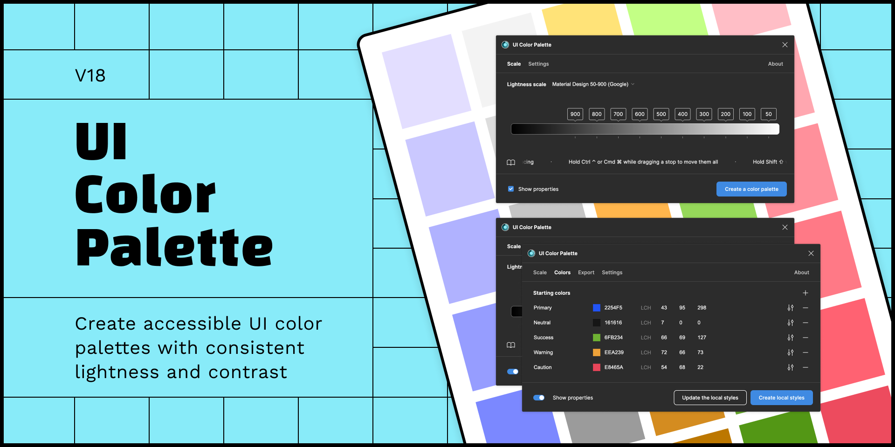

# Welcome aboard!

<figure><figcaption></figcaption></figure>

UI Color Palette is a Figma plugin that generates consistent and accessible color palettes. The plugin uses the `LCH model` to generate colors according to the chosen lightness scale. This model is relevant to make colors compliant with the [WCAG standards](https://www.w3.org/WAI/standards-guidelines/wcag/). The idea to make this Figma plugin comes from that article: [Accessible Palette: stop using HSL for color systems](https://wildbit.com/blog/accessible-palette-stop-using-hsl-for-color-systems).

This plugin will allow you to:

* Generate a complete palette from any existing color, that will help you build a color system
* Adjust the color palette in real-time to control the contrast
* Deploy the color palette by publishing it as local styles or exporting it as design tokens
