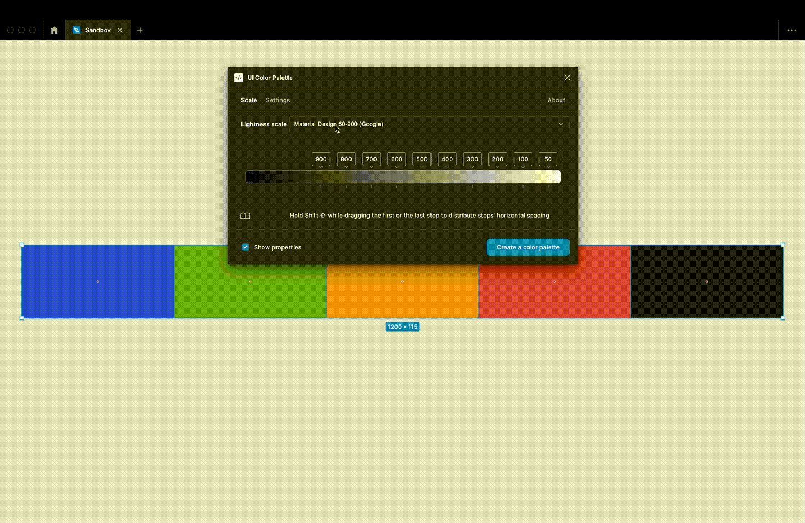

# Choose a lightness scale preset

<figure><figcaption></figcaption></figure>

A preset contains a list of stops named from an established nomenclature. These presets are frameworks that can help you build a color system:

* `Material Design`, 10 stops, from 50 to 900 (Google)
* `Ant Design`, 10 stops, from 1 to 10
* `ADS Foundations` (Atlassian):
  * 7 stops, from 50 to 500
  * 19 stops (for neutral colors), from 0 to 900
* `Carbon`, 10 stops, from 10 to 100 (IBM)
* `Base`, 8 stops, from 50 to 700 (Uber)

Or make your own from 2 to 24 stops via the `Custom` preset.


Manage more than 15 stops could complicate the color system. It also depends of the number of the `Starting colors`.

