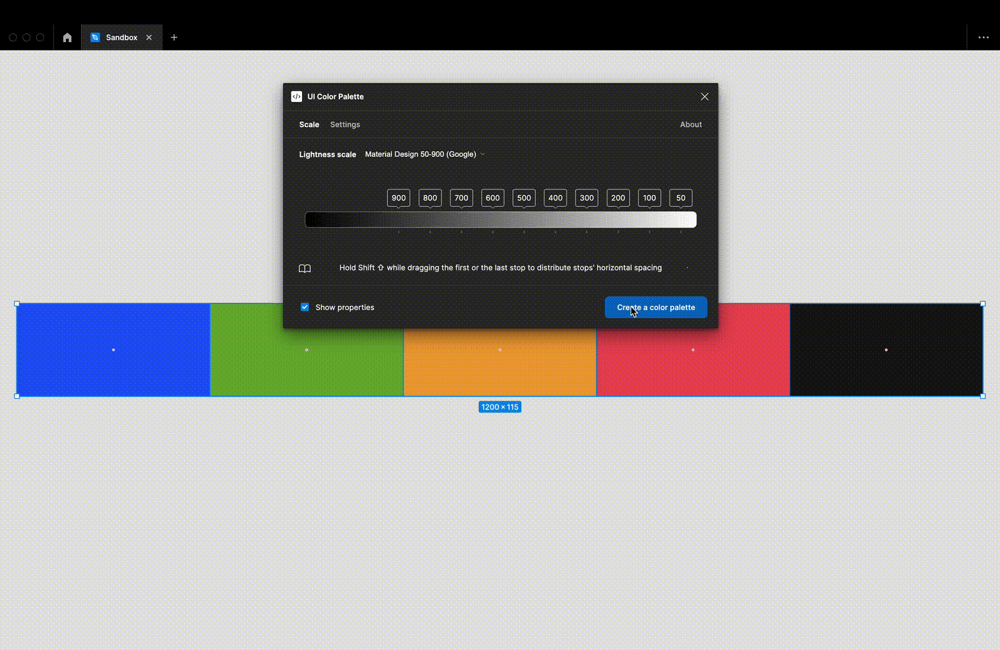

# Generate the color palette

## Display the properties of the color shades

You can choose to display the properties of every color shade. These properties are:

* The color shade name (according to the chosen color system)
* The `hexadecimal code`
* The `LCH` values
* The `WCAG 2.1` contrast score
* The `APCA` contrast score

## Create the palette in one single click

<figure><figcaption></figcaption></figure>

The palette is instantly created by clicking on `Create color palette`, according to the `Lightness scale` and the `Palette name`.


The palette architecture on the canvas is:

* `paletteName`・`presetName`
  * \_colors
    * \_title
    * \_header
      * Colors
      * `minStopName`
      * …
      * `maxStopName`
    * `layerName`
      * `layerName`
      * `minStopName`
      * …
      * `maxStopName`
    * …



Avoid editing the palette directly on the document canvas

