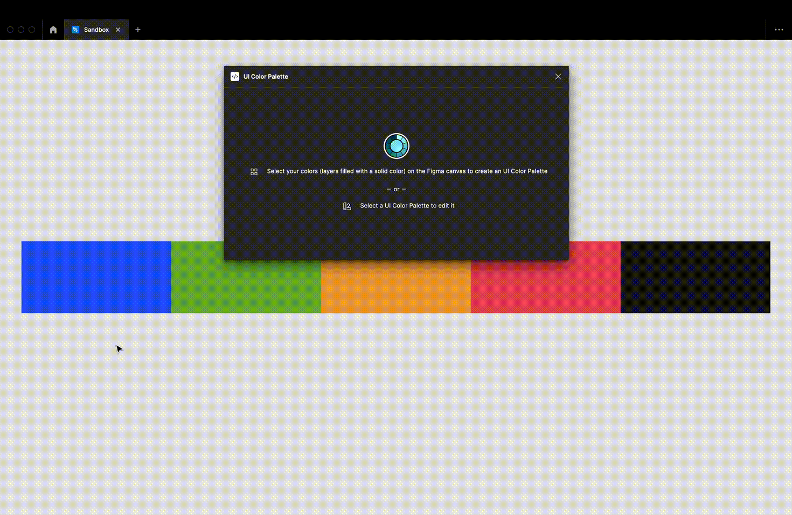

# Select the starting colors

<figure><figcaption></figcaption></figure>

Select some filled layers to access the configuration. You might rename these layers because the palette will use the layer name as color name.


The selected layers must have at least a solid color as `Fill` property

