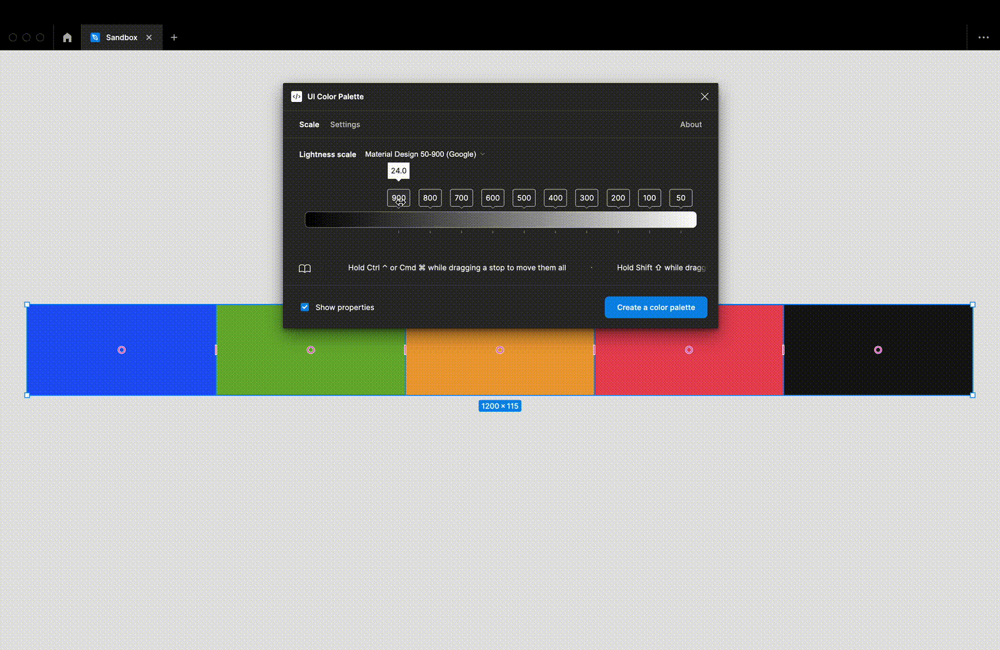

# Set the lightness scale stops

<figure><figcaption></figcaption></figure>


Create first the palette to tweak the lightness scale in real-time


Update a stop by sliding its knob on the range. You can slide every knob by using these shortcuts:

* `Cmd ⌘` (macOS) or `Ctrl ⌃` (Windows) while sliding any knob to move each of them to the desired direction
* `⇪ Shift` while sliding the first or the last stop to distribute equally each of them on the range
