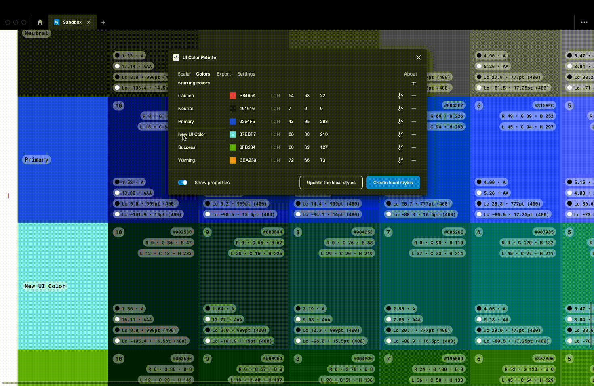
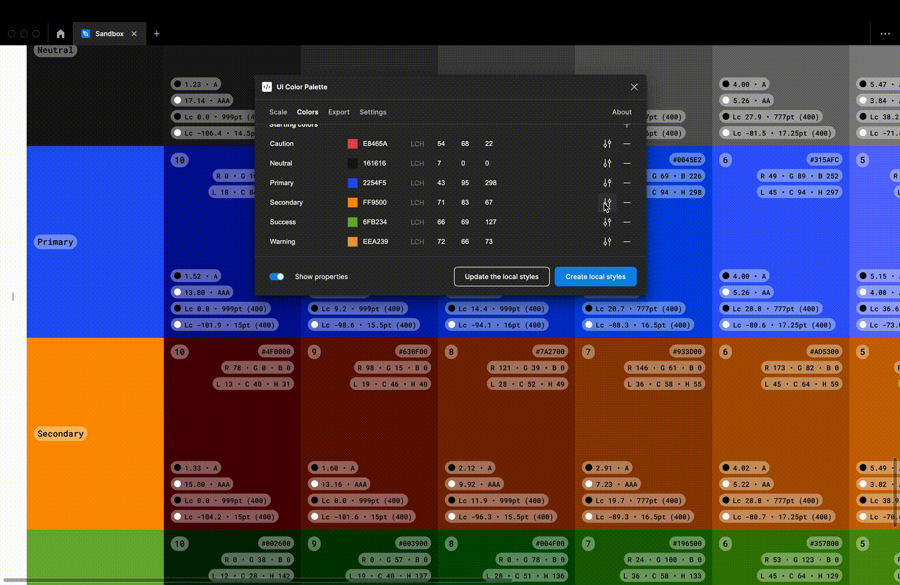
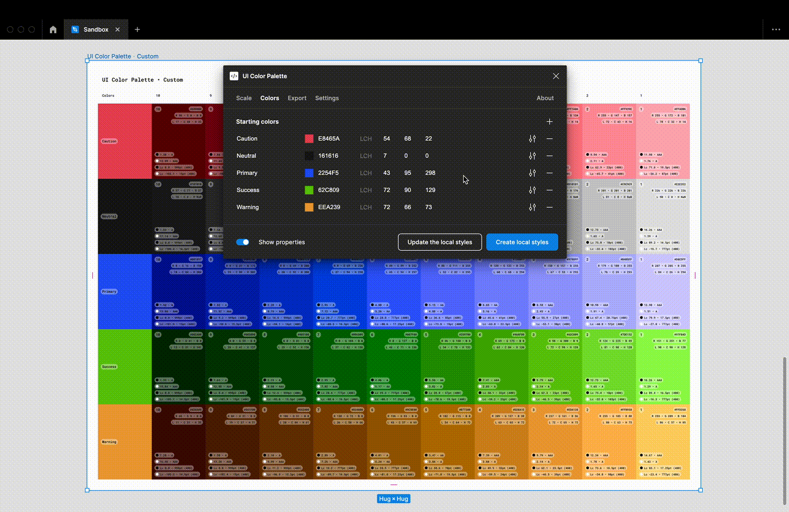
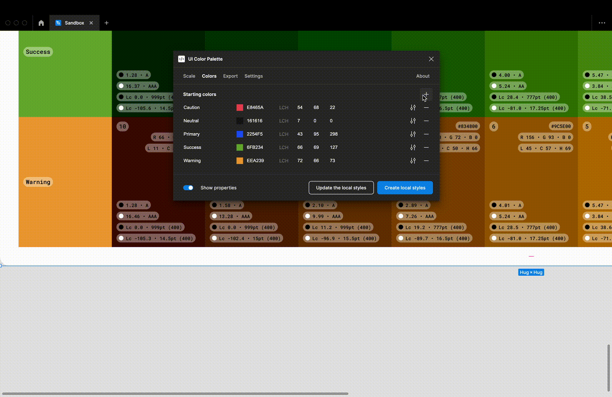

# Change the starting colors


Performance might be impacted if:

* The palette contains more than 16 stops and 8 colors
* The properties are displayed


## Change a color's parameters

<figure><figcaption></figcaption></figure>

You can change in real-time the name of color, and its hexadecimal code (via the color picker or the text input). You can also watch the `LCH` values, that might be changed directly to update the color.


The number inputs copycat the Figma ones


<figure><figcaption></figcaption></figure>

There are more advanced options to get a better control. You can toggle the OKLCH space of the color on to get a deeper progression of its shades. The hue range can be also shifted to adjust more finely the shades' progression (very useful for the yellow colors).

## Reorder the colors

<figure><figcaption></figcaption></figure>

You can reorder the colors list by dragging an item and dropping it above or below another.&#x20;


The reorder copycats the Figma one


## Add or remove a color

<figure><figcaption></figcaption></figure>

Click on the Plus icon to add a new color in the `Starting colors`. There is a Minus icon at each color to remove it definitively from the palette (but it can be redo on the canvas).


The default name of a new color is `New UI Color`

